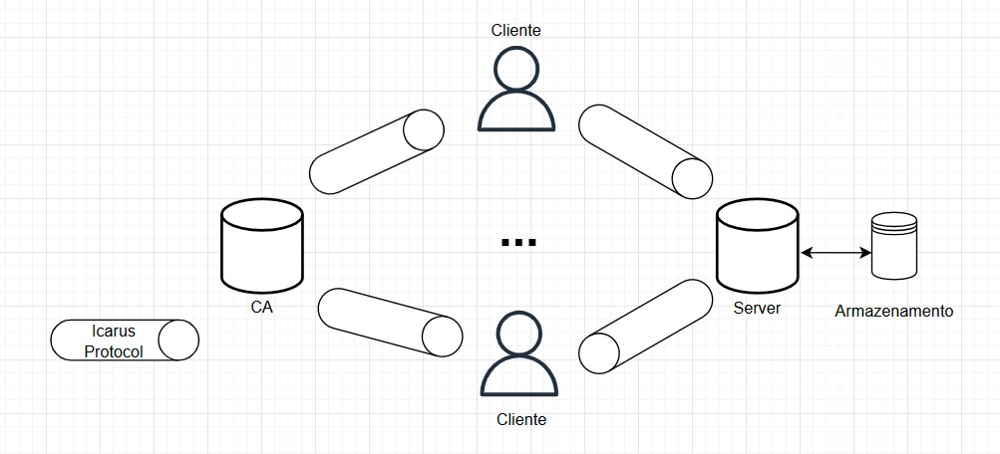
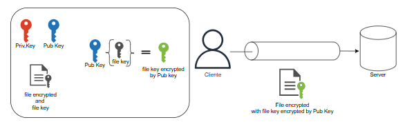
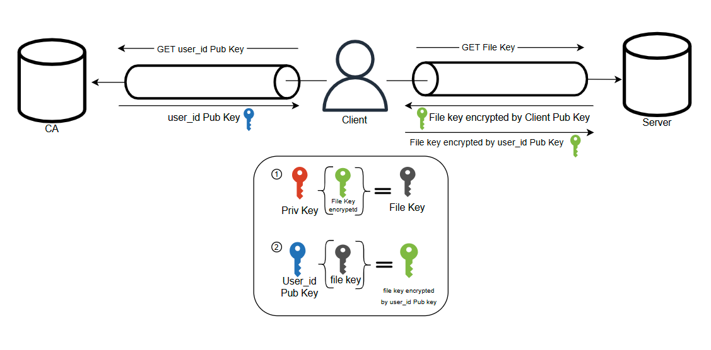
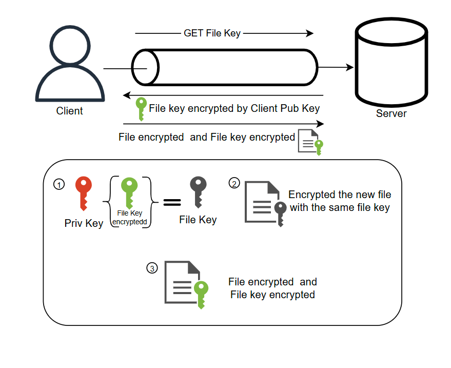
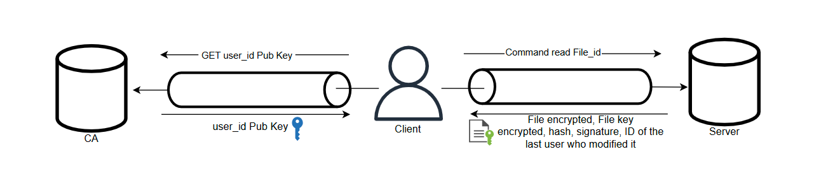
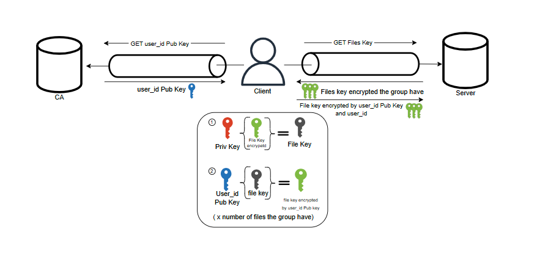
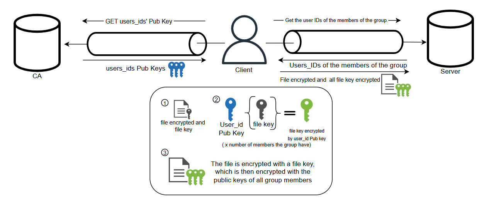

# Relatório

## Introdução

Este relatório tem como objetivo apresentar o trabalho prático desenvolvido no âmbito da unidade curricular de **Segurança de Sistemas Informáticos (SSI)**,realizada no ano letivo de 2024/25. Ao longo deste documento serão discutidas as decisões tomadas durante o processo de desenvolvimento, bem como descritas as funcionalidades implementadas pelo nosso grupo.

O projeto consistiu na criação de um *serviço de cofre seguro*, destinado a permitir que os membros de uma organização possam armazenar e partilhar ficheiros de texto de forma segura, garantindo a sua autenticidade, integridade e confidencialidade. Adicionalmente, o serviço foi concebido para suportar a gestão de grupos de utilizadores e de utilizadores individuais.

## Arquitetura
Para dar uma resposta completa ao problema apresentado no enunciado do trabalho, a nossa aplicação foi concebida com base num modelo distribuído, composto por um cliente e dois servidores distintos, cada um com responsabilidades bem definidas.

A solução é constituída por três programas principais:

1. Autoridade Certificadora (CA):
Este componente funciona como uma entidade central de confiança para todos os intervenientes no sistema. A sua função principal é emitir e assinar certificados digitais para os utilizadores e servidores, garantindo a autenticidade das suas identidades. Cada identidade no sistema possui um certificado digital X.509 e um par de chaves RSA (uma pública e uma privada), que são utilizados para operações de autenticação, cifragem e assinatura digital. A CA opera em dois modos distintos:

    -  Modo de emissão de certificados: gera certificados X.509 e os respetivos pares de chaves (ficheiros .p12) para todos os participantes (clientes e servidores), associando cada identidade ao seu par de chaves.

    - Modo de resolução de pedidos: responde a solicitações dos clientes, fornecendo informações essenciais para o estabelecimento de comunicações seguras, como a chave pública de outros utilizadores.

2. Servidor de Armazenamento:
Este componente é responsável por armazenar os ficheiros enviados pelos clientes e processar os respetivos pedidos de acesso. Foi concebido para funcionar como um mero intermediário (man-in-the-middle controlado), sem acesso ao conteúdo dos ficheiros em formato legível. Para garantir a confidencialidade, todos os dados são cifrados no lado do cliente antes da transmissão, e o servidor não detém as chaves necessárias para a sua descodificação.

3. Cliente:
É a aplicação utilizada pelos membros da organização para interagir com o sistema. Os clientes são responsáveis por:

    - Cifrar e assinar digitalmente os ficheiros antes de os enviar ao servidor;

    - Solicitar chaves públicas à CA;

    - Recolher ficheiros do servidor e proceder à sua verificação e descodificação localmente;

    - Gerir permissões e partilhas de ficheiros com outros utilizadores, com base em mecanismos criptográficos.

Esta arquitetura visa garantir a segurança da informação através da descentralização de responsabilidades e da aplicação de princípios de criptografia forte entre os elementos do sistema.

Para possibilitar a comunicação entre as três entidades, foi desenvolvido um protocolo próprio — o Icarus Protocol — com o objetivo de estabelecer canais de comunicação seguros. Cada cliente mantém duas conexões ativas em simultâneo: uma com o servidor de armazenamento e outra com a Autoridade Certificadora (CA), assegurando assim uma comunicação contínua, fiável e segura com ambos os componentes do sistema.



## Mínimos de Confiança Assumidos
Para garantir a segurança e o funcionamento correto do sistema, foram assumidos os seguintes pressupostos de confiança:

- A Autoridade Certificadora (CA) é totalmente fidedigna:
Presume-se que a CA não se encontra comprometida e que cumpre corretamente as suas funções, nomeadamente a emissão e gestão de certificados digitais, a resposta a pedidos dos clientes e a manutenção da integridade da sua chave privada.

- O servidor de armazenamento não é confiável no que respeita à confidencialidade dos dados:
Assume-se que o servidor pode ser potencialmente comprometido ou agir de forma curiosa. Por esse motivo, não lhe é confiada qualquer chave de descodificação dos ficheiros armazenados. Ainda assim, espera-se que execute corretamente as suas funções, nomeadamente o armazenamento dos dados cifrados e a resposta adequada aos pedidos dos clientes.


## Implementação

### Icarus Protocol

Para garantir um canal seguro de comunicação entre as entidades do sistema, desenvolvemos o Icarus Protocol, inspirado no protocolo TLS (Transport Layer Security), um padrão amplamente adotado para comunicações seguras na Internet. O Icarus Protocol foi concebido com particular foco na dupla autenticação, ou seja, tanto o cliente como o servidor autenticam-se mutuamente antes de qualquer troca de dados.

Fase de Handshake
A fase inicial do protocolo — o handshake — estabelece uma base segura para comunicação, através dos seguintes passos:

1. CLIENT_HELLO:
O cliente inicia a comunicação enviando um pacote CLIENT_HELLO, que contém o seu certificado digital (codificado em base64) e o nome do certificado. Este certificado será posteriormente verificado e validado pela entidade que o recebe.

2. SERVER_HELLO:
O servidor responde com um pacote SERVER_HELLO, que inclui o seu próprio certificado digital (também codificado em base64), bem como um nonce (valor aleatório), de uso único e com validade de 1 minuto. Este nonce é utilizado como parte da verificação de autenticidade e, para garantir a sua confidencialidade, é cifrado com a chave pública extraída do certificado enviado pelo cliente no CLIENT_HELLO.

3. CLIENT_AUTH:
O cliente responde com o pacote CLIENT_AUTH, que contém:

    - O nonce enviado pelo servidor;

    - Um novo nonce gerado pelo cliente, cifrado com a chave pública do certificado recebido do servidor;

    - Uma assinatura digital que autentica ambos os nonces, confirmando a posse da chave privada correspondente ao seu certificado.

4. SERVER_AUTH:
O servidor, por sua vez, envia o pacote SERVER_AUTH contendo:

    - O nonce gerado pelo cliente;

    - Um valor aleatório adicional (server_random);

    - Uma assinatura digital que autentica ambos os valores, validando a identidade do servidor.

Troca de Chaves e Confirmação

5. KEY_EXCHANGE:
O cliente envia um valor aleatório adicional (client_random) no pacote KEY_EXCHANGE. Tanto o client_random como o server_random, previamente trocados (e cifrados com a chaves pública da outra entidade), são utilizados como material de entrada para a derivação de uma chave de sessão comum, recorrendo ao mecanismo HKDF (HMAC-based Key Derivation Function) com o algoritmo SHA-256.

6. CHANGE_CIPHER_SPEC:
Após a derivação da chave de sessão, o cliente envia um pacote CHANGE_CIPHER_SPEC, indicando o algoritmo de cifra a ser utilizado (neste caso, AES-GCM).

7. FINISH:
Finalmente, o cliente envia um pacote FINISH com um valor codificado em base64 que representa a confirmação do sucesso do handshake. O servidor poderá responder com um ACK para validar a receção.

Comunicação Segura (DATA_EXCHANGE)
Com o canal estabelecido, os pacotes DATA_EXCHANGE são utilizados para a transmissão segura de dados. O conteúdo é cifrado com AES no modo GCM, que garante simultaneamente a confidencialidade e integridade dos dados. Cada pacote contém:

 - Os dados cifrados;

 - O vetor de inicialização (IV);

 - A tag de autenticação (GCM tag).

Todos os valores transmitidos são codificados em formato base64, o que facilita a interoperabilidade entre as diferentes entidades do sistema. Importa salientar que todos os valores aleatórios utilizados — incluindo nonces, randoms e vetores de inicialização (IVs) — são gerados com recurso à função os.urandom(), garantindo um elevado nível de entropia e robustez criptográfica. Para reforçar a segurança do protocolo, foi ainda desenvolvido um módulo dedicado à validação de certificados, bem como funções auxiliares para assinatura, verificação e cifragem de dados sensíveis de forma consistente e segura.

**Confidencialidade, Integridade e Autenticidade**
O Icarus Protocol foi desenvolvido com base nos princípios fundamentais da cibersegurança, frequentemente representados pelo Triângulo CIA — Confidencialidade, Integridade e Autenticidade (ou Disponibilidade). A confidencialidade é garantida através da cifragem de dados com algoritmos robustos como AES-GCM e da utilização de chaves assimétricas RSA para troca segura de segredos. A integridade dos dados é assegurada pela utilização de tags de autenticação e assinaturas digitais, impedindo que dados sejam alterados sem deteção. A autenticidade é reforçada pela utilização de certificados digitais X.509 e por um processo de autenticação mútua durante o handshake. Esta abordagem holística alinha-se também com o Pentágono da Segurança da Informação, que além dos três pilares do Triângulo CIA, inclui Disponibilidade e Não Repúdio, dois princípios que o Icarus também considera ao garantir acessos autorizados e operações auditáveis por meio de assinaturas digitais.


### Gestão de Ficheiros e Controlo de Acessos
Para garantir a confidencialidade dos ficheiros armazenados no servidor — impedindo que este consiga aceder ao conteúdo em formato legível — foi concebido um mecanismo de gestão de ficheiros baseado em criptografia simétrica e controlo de acessos com listas ACL (Access Control Lists).

A opção por criptografia simétrica (neste caso, AES no modo GCM) prende-se com uma limitação prática e técnica da criptografia assimétrica: esta não é adequada para cifrar grandes volumes de dados, como ficheiros. Os algoritmos assimétricos, como o RSA, são computacionalmente dispendiosos e têm limites máximos para o tamanho de dados que conseguem cifrar diretamente. Como não conhecemos previamente o tamanho dos ficheiros a armazenar — e estes podem ser potencialmente grandes —, a solução eficiente e escalável é recorrer à cifra simétrica para o conteúdo dos ficheiros.

Cada ficheiro é, assim, associado a uma chave simétrica única, gerada localmente pelo cliente. Essa chave é usada para cifrar o ficheiro com o algoritmo AES-GCM, que garante simultaneamente confidencialidade e integridade (através de um tag de autenticação). 





Como o servidor não detém as chaves simétricas(em claro), não consegue aceder ao conteúdo dos ficheiros. Para que outros utilizadores possam ter acesso, essa mesma chave simétrica é cifrada com a chave pública de cada utilizador autorizado — utilizando então criptografia assimétrica, apropriada para pequenas quantidades de dados como chaves ou segredos.

Este modelo híbrido permite tirar partido das vantagens de ambos os tipos de cifra: simétrica para desempenho e manuseamento de grandes volumes, e assimétrica para garantir a segurança na partilha controlada de chaves.

Além disso, um sistema semelhante é utilizado no canal de comunicação, onde também se utiliza criptografia simétrica (AES-GCM) com chaves de sessão derivadas após um handshake seguro. No entanto, as chaves usadas para os ficheiros e para o canal são diferentes, garantindo separação de contexto e maior segurança criptográfica.

A gestão de permissões é feita através de duas estruturas ACL distintas:

ACL individual: um dicionário na forma ```user_id → file_id → permissões```, que controla as permissões de acesso de cada utilizador a cada ficheiro.

ACL de grupo: uma estrutura na forma ```group_id → user_id → file_id → permissões```, que permite gerir permissões em contexto de grupos, facilitando a partilha e colaboração entre múltiplos utilizadores.

Existem três níveis de permissões:

 - own (proprietário);

- read (leitura);

- write (escrita).


Estas permissões podem ser atualizadas dinamicamente através dos comandos disponíveis na aplicação, refletindo alterações de propriedade, partilhas ou revogações de acesso. A lógica de verificação de permissões é aplicada no lado do cliente, reforçando a segurança ao impedir que o servidor interfira ou valide acessos por si só.


### Comandos da aplicação cliente

Implementámos todos os comandos descritos no enunciado e, de seguida, vamos aprofundar alguns deles, uma vez que acrescentámos funcionalidades adicionais que considerámos necessárias para a construção de um sistema seguro.

- ```add <file-path>```
Este comando adiciona o ficheiro indicado por ```<file-path>``` ao cofre pessoal, fazendo com que passe a estar disponível nesse cofre. Este processo é semelhante ao ilustrado na imagem nº 2 e segue o que já foi anteriormente referido: o cliente, localmente, cria uma chave simétrica, cifra o conteúdo do ficheiro com essa chave e, em seguida, envia o ficheiro cifrado. A chave simétrica é encriptada com a chave pública do utilizador que está a adicionar o ficheiro. Para além disso, é também enviada a hash do ficheiro original (antes da cifragem), bem como a assinatura digital do utilizador, garantindo a integridade e autenticidade do conteúdo adicionado.

- ```share <file-id> <user-id> <permisson>```
Este comando permite partilhar um ficheiro do cofre pessoal com outro utilizador, atribuindo-lhe permissões de leitura ou de escrita.

    Este processo apresenta uma certa complexidade, uma vez que é necessário conhecer a chave pública do utilizador com quem queremos partilhar o ficheiro, bem como a chave simétrica correspondente a esse ficheiro.

    A nossa solução é a seguinte: como o cliente apenas pode partilhar ficheiros que já se encontram no seu cofre pessoal (isto é, ficheiros aos quais tem acesso), o comando inicia por fazer um pedido ao servidor (GET) para obter a chave simétrica do ficheiro. Em seguida, faz um pedido à Autoridade Certificadora (CA) para obter a chave pública do utilizador com quem se pretende partilhar o conteúdo.

    Depois de obter ambas as chaves, o cliente local decifra a chave simétrica do ficheiro com a sua chave privada e, de seguida, cifra essa mesma chave com a chave pública do utilizador destinatário. Esta nova versão cifrada da chave simétrica é então enviada ao servidor, onde será guardada. Ao mesmo tempo, as permissões de acesso desse utilizador são atualizadas na tabela de controlo de acessos (ACL) mencionada anteriormente.

    Importa referir que cada ficheiro possui um dicionário onde são armazenadas as chaves simétricas cifradas, associadas a cada utilizador autorizado. Dessa forma, cada utilizador tem acesso apenas à versão da chave cifrada com a sua própria chave pública, garantindo assim a confidencialidade e o controlo de acessos.

    

- ```replace <file-id> <file-path>```
    Este comando substitui o conteúdo de um ficheiro existente por um novo ficheiro indicado em <file-path>. Esta operação só pode ser realizada por utilizadores que possuam permissões de escrita sobre o ficheiro em questão.

    A lógica deste comando é semelhante à do comando ```share```, uma vez que o cliente precisa de conhecer a chave simétrica usada originalmente para cifrar o ficheiro. Assim, o cliente começa por fazer um pedido GET ao servidor para obter essa chave. De seguida, cifra o conteúdo do novo ficheiro utilizando a mesma chave simétrica, garantindo que os utilizadores previamente autorizados continuarão a ter acesso.

    Para além do conteúdo cifrado, o cliente envia também a hash do novo ficheiro (calculada antes da cifragem) e a assinatura digital do utilizador que realizou a substituição, garantindo a integridade e autenticidade da operação — tal como já acontece no comando ```add```.

    Optámos por seguir esta abordagem porque, num cenário em que o ficheiro é partilhado com múltiplos utilizadores, criar uma nova chave e substituir simplesmente o conteúdo original faria com que todos os utilizadores perdessem o acesso, uma vez que já não teriam a nova chave. Ao reutilizar a chave existente, evitamos a necessidade de atualizar as chaves cifradas de todos os utilizadores na tabela ACL, mantendo o acesso intacto e o sistema mais eficiente.




 - ```read <file-id>```
Embora o comando de leitura (read) possa aparentar ser simples, o seu funcionamento adquire uma camada adicional de complexidade devido à utilização de assinaturas digitais no nosso sistema. Esta abordagem tem como objetivo garantir a autenticidade e integridade do conteúdo lido.

    Para validar a assinatura digital associada a um ficheiro, é necessário saber quem foi o último utilizador a escrever nesse ficheiro, bem como obter a sua chave pública. Para suportar este processo, decidimos guardar, juntamente com os metadados do ficheiro, a identidade do último utilizador que realizou uma operação de escrita (por exemplo, via add ou replace).

    Assim, quando um cliente executa o comando read, o sistema envia as informações necessárias para a leitura, tais como a chave, o hash do ficheiro, a assinatura digital e a identificação da última pessoa que escreveu no ficheiro. Com base nesses dados, o cliente pode solicitar à Autoridade Certificadora (CA) a chave pública do utilizador identificado, de forma a verificar a assinatura digital. Este processo permite confirmar que o conteúdo não foi adulterado e que foi efetivamente escrito pelo utilizador indicado.

    Este mecanismo proporciona um nível adicional de segurança, permitindo aos clientes verificar tanto a proveniência como a integridade dos dados que estão a consultar.

    

-  ```group add-user <group-id> <user-id> <permissions> ```
    Se o grupo já contém ficheiros partilhados, o novo utilizador precisa de obter acesso seguro às chaves de cifragem desses ficheiros. Como estes são cifrados com chaves simétricas (armazenadas cifradas com a chave pública de cada utilizador autorizado), é necessário seguir os seguintes passos:

    O servidor fornece ao utilizador que executa o comando (unicamente o dono do grupo) as versões cifradas das chaves simétricas dos ficheiros, as quais este pode descifrar localmente com a sua própria chave privada.

    Em seguida, o cliente faz um pedido à Autoridade Certificadora (CA) para obter a chave pública do novo utilizador a adicionar.

    Após obter a chave pública, o cliente volta a cifrar cada uma das chaves simétricas dos ficheiros com essa chave pública.

    Estas versões cifradas das chaves são então enviadas para o servidor, que atualiza os metadados dos ficheiros e a tabela de controlo de acessos (ACL), garantindo que o novo utilizador passa a ter acesso aos ficheiros de acordo com as permissões atribuídas.

    Este processo garante a confidencialidade das chaves e o controlo eficaz de acessos dentro do grupo, mantendo a segurança da partilha de ficheiros.


    


- ```group add <group-id> <file-path>```
    Este comando permite adicionar um ficheiro a um grupo, garantindo que todos os membros autorizados conseguem aceder a esse ficheiro de forma segura. Se o grupo apenas tiver o seu criador (owner) como membro, o funcionamento é semelhante ao comando add do cofre pessoal. O cliente gera uma chave simétrica para cifrar o ficheiro e depois cifra essa chave com a sua própria chave pública. O ficheiro cifrado, a chave cifrada, a hash do ficheiro e a assinatura digital são enviados para o servidor.

    Quando o grupo já contém vários membros, o processo torna-se um pouco mais complexo. Após o envio do comando, o servidor verifica se o utilizador tem permissões de owner e devolve a lista de membros do grupo. O cliente contacta então a Autoridade Certificadora (CA) para obter as chaves públicas desses membros. Com essas chaves, cifra individualmente a chave simétrica do ficheiro para cada utilizador e envia todas as versões cifradas para o servidor, juntamente com o ficheiro cifrado e os metadados.

    Este processo garante que apenas os membros autorizados conseguem aceder ao ficheiro, mantendo a confidencialidade, integridade e controlo de acessos dentro do grupo




- Outros comandos restantes implementados, tais como:

    - ```list [-u user-id | -g group-id]```
    - ```  delete <file-id>```
    - ```  details <file-id>```
    - ```  revoke <file-id> <user-id>```
    - ```  read <file-id>```
    - ```  group create <group-name>```
    - ```  group delete <group-id>```
    - ```  group delete-user <group-id> user-id>```<
    - ```  group list```
    - ``` exit```

Seguem um modelo simples de interação entre cliente e servidor. O cliente envia o pedido correspondente ao comando e o servidor executa a operação, devolvendo a resposta com a informação pretendida ou uma mensagem de confirmação.

Comandos como list, group list e details são operações de leitura, nas quais o servidor responde com os dados solicitados (como lista de ficheiros, grupos ou metadados). Já comandos como delete, revoke, group delete e group delete-user alteram o estado do sistema e, por isso, exigem uma verificação prévia de permissões.

Importa referir que todos os comandos, mesmo os de leitura, são sujeitos a validação de permissões por parte do servidor. O servidor verifica sempre se o utilizador que executa o comando tem os direitos necessários — seja como dono do ficheiro/grupo ou com permissões específicas atribuídas (como leitura ou escrita). Esta verificação garante o controlo de acessos e reforça a segurança do sistema, impedindo operações não autorizadas.

## Aspetos a melhorar

Alguns aspetos adicionais que poderiam ser melhorados ou implementados para reforçar a robustez e a usabilidade do sistema incluem a renovação automática de certificados, a negociação dinâmica de algoritmos criptográficos durante o protocolo de comunicação, e o desenvolvimento de interfaces de monitorização e gestão em tempo real.

Em primeiro lugar, seria vantajoso que tanto os clientes como o servidor pudessem realizar pedidos automáticos de renovação de certificados à autoridade certificadora (CA). Este mecanismo reduziria o risco associado a certificados expirados e garantiria a continuidade segura das comunicações, sem necessidade de intervenção manual. Tal funcionalidade poderia ser integrada com protocolos como o ACME (Automatic Certificate Management Environment), amplamente utilizado para este fim.

Durante o protocolo ICARUS, atualmente utilizado para estabelecer comunicações seguras, existe uma fase de troca de mensagens que poderia ser aproveitada para negociar dinamicamente o algoritmo de cifra simétrica a utilizar no canal seguro. Esta extensão permitiria uma maior flexibilidade e a possibilidade de adotar algoritmos mais modernos ou adaptados ao contexto de uso (por exemplo, ChaCha20-Poly1305 em ambientes com recursos limitados), promovendo assim uma maior resiliência e segurança criptográfica do sistema.

Adicionalmente, a implementação de uma interface web para visualização e análise em tempo real dos logs do servidor e da CA traria claras vantagens em termos de monitorização e auditoria. Através desta interface seria possível consultar estatísticas de uso, detetar padrões anómalos de acesso, e obter uma visão mais clara do estado geral do sistema, facilitando também o trabalho de resposta a incidentes.

Por fim, uma funcionalidade útil a considerar seria a criação de grupos com máscaras de permissões predefinidas. Esta abordagem simplificaria a gestão de acessos em ambientes colaborativos, permitindo configurar rapidamente permissões de leitura, escrita e partilha para todos os membros de um grupo, sem necessidade de definições individuais para cada utilizador.
## Conclusão
O desenvolvimento deste projeto permitiu-nos aplicar, de forma prática, os conhecimentos adquiridos ao longo da unidade curricular de Segurança de Sistemas Informáticos, consolidando conceitos essenciais como autenticação mútua, cifragem simétrica e assimétrica, assinaturas digitais e gestão de certificados X.509.

A criação do Icarus Protocol foi um dos principais desafios e conquistas deste trabalho, permitindo-nos compreender com maior profundidade o funcionamento de protocolos de segurança como o TLS. Através deste protocolo, conseguimos estabelecer comunicações seguras entre os diferentes componentes do sistema, garantindo os princípios fundamentais da cibersegurança: confidencialidade, integridade, autenticidade e não repúdio.

Além disso, a implementação de um sistema de controlo de acessos com suporte a utilizadores e grupos, baseado em listas ACL e distribuição segura de chaves, permitiu-nos criar um serviço robusto de partilha de ficheiros, que resiste a ataques mesmo quando o servidor de armazenamento é considerado não confiável.

Este projeto destacou a importância de uma abordagem “security-by-design”, onde a segurança é considerada desde o início do desenvolvimento, e não como uma camada adicional posterior. A divisão clara de responsabilidades entre cliente, servidor e autoridade certificadora, aliada a uma gestão segura das chaves e das permissões, contribuiu para a construção de um sistema fiável e resiliente.

Em suma, este trabalho não só nos proporcionou um maior domínio técnico sobre mecanismos de segurança, como também reforçou a nossa capacidade de pensar criticamente sobre os riscos e garantias necessários na conceção de sistemas distribuídos seguros.


